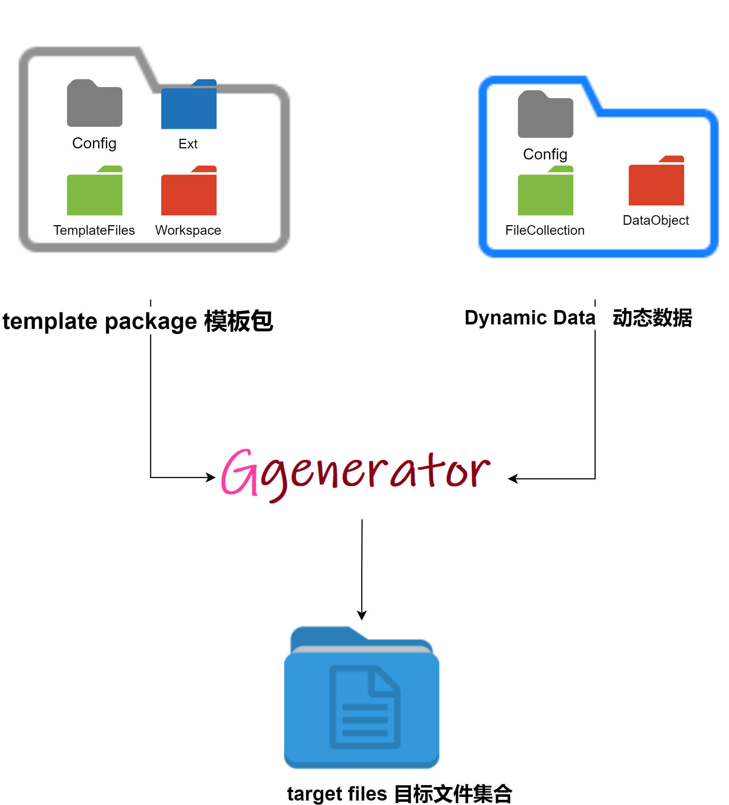

<div align=center></div>

[english readme here](./readme_en.md)

1. ggenerator 是一个代码生成引擎，核心是根据动态数据和模板生成需要的文件集合
2. ggenerator通过fom（file object model文件对象模型) 描绘对文件的操作
3. ggenerator通过模板引擎（juicer，可扩展为其他) 实现文件中内容的动态生成
4. 那么如何根据输入项来生成不同的文件呢，即通过模板方式定义fom，实现对文件的动态生成
5. 除此之外，内容能否重复生成，也是gg接下来要做的事情

## 了解gg



[简介](./doc/core.md)

## how to use 
### cli
```bash
npm i ggenerator.js -g

gg -h

# get empty template
gg empty

cd /templates  # template root dir 模板根目录

gg config 

#generate codes 
gg yourTemplateName ddataPath  -t targetDir

#use history
npm i -g history.node

hist
hist -h
# run last
hist last
```

### use as npm package

```bash
npm i ggenerator.js --save
```

```js
//js
require('ggenerator.js').run(dDataPath,template,targetPath,workplace,callback)
```

## what is uiddata
when you use comboTemplate(of course not only ct),ddata is in the template.  
we must need change some data,it is uiddta  
details @ [doc/uiddata.md](doc/uiddata.md)

## Q&A
[QA.md](QA.md)


## how to share templates Package
use git to share  
```bash
git clone https://github.com/aceunlonely/ggenerator-templates
cd ggenerator-templates
gg config
```

